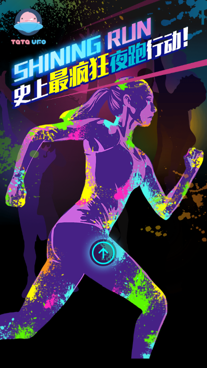
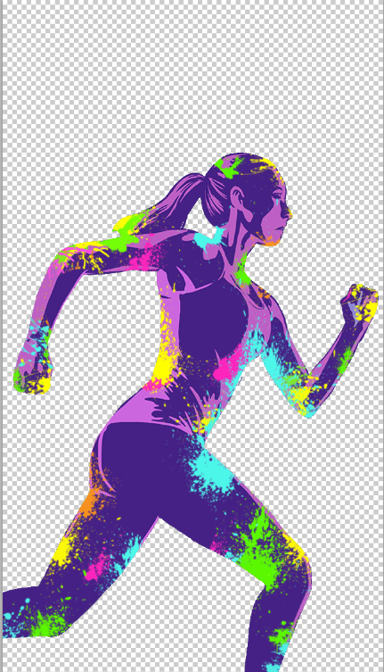

# yingguangpao
这是我第一个做的移动场景，没有任何参考，按照自己的想法去写，后来学会了更加简单的触发动画的写法

### 使用的框架
做移动场景的框架，我觉得除了swiper，没有更好的了，动画框架也是用的swiper的，写的挺详细的可以去看一下<br>
[swiper animate链接](http://www.swiper.com.cn/usage/animate/index.html)
[swiper链接](http://www.swiper.com.cn/)

### 移动场景切图技巧
做移动场景最麻烦的地方就是定位了，如果只把图片拿出来的话，要适应不同屏幕的宽度和定位，就要用百分比去设宽度，离左边百分比这样，而更困难的地方在于，每个手机比例不一样，用top百分比去定位根本就不可能。当然可以用rem布局和padding百分比的方法去解决，但是我这里介绍一个更加无脑的方法
##### 这是主页的图

##### 这是切出来的女孩的图

这样切图，我们只需要每一p所有图片宽度百分百占满就行了，和绝对定位叠在一起
*优点：几乎不需要布局，相对非常精确
*缺点：因为要适应iphone4几乎是正方形比例的屏幕，所以需要把内容区集中在上半部分（当然也是有办法去解决的，例如用js去居中内容区，放大之类的）

###加载动画
还有一个比较值得说的是加载动画，如何让进度从0%-100%，这是让许多新手头痛的问题。可能很多人跟我一开始想的一样，做一个假的动画，用定时器从0%显示到99%，当window.onload的时候显示100%并且去掉加载页。但是这个不可取，因为没有实时跟着进度加载，卡在99%也会体验不好。
####下面是一种解决方案
````javascript
   var loadPercent = 0;//加载的进度
   var currentPercent = 0;//显示出来的数字
   var imgsrc = [//把图片放进数组
   {src:"dist/img/p1/girl.png",id:"",per:"1"},
   {src:"dist/img/p1/guys.png",id:"",per:"3"},
   {src:"dist/img/p1/logo.png",id:"",per:"4"},
   {src:"dist/img/p1/run.png",id:"",per:"7"},
   {src:"dist/img/p1/shine.png",id:"",per:"9"},
   {src:"dist/img/p1/x.png",id:"",per:"10"},
   {src:"dist/img/p2/girl.png",id:"",per:"11"},
   {src:"dist/img/p2/guys.png",id:"",per:"12"},
   {src:"dist/img/p2/shine.png",id:"",per:"13"},
   {src:"dist/img/p2/title1.png",id:"",per:"14"},
   {src:"dist/img/p2/title2.png",id:"",per:"15"},
   {src:"dist/img/p3/boy.png",id:"",per:"16"},
   {src:"dist/img/p3/house.png",id:"",per:"20"},
   {src:"dist/img/p3/light.png",id:"",per:"22"},
   {src:"dist/img/p3/paper.png",id:"",per:"23"},
   {src:"dist/img/p3/title1.png",id:"",per:"26"},
   {src:"dist/img/p3/title2.png",id:"",per:"28"},
   {src:"dist/img/p3/window.png",id:"",per:"30"},
   {src:"dist/img/p4/boy.png",id:"",per:"37"},
   {src:"dist/img/p4/muscle.png",id:"",per:"39"},
   {src:"dist/img/p4/shine.png",id:"",per:"45"},
   {src:"dist/img/p4/title1.png",id:"",per:"48"},
   {src:"dist/img/p4/title2.png",id:"",per:"55"},
   {src:"dist/img/p4/wc.png",id:"",per:"59"},
   {src:"dist/img/p5/door.png",id:"",per:"66"},
   {src:"dist/img/p5/girl.png",id:"",per:"70"},
   {src:"dist/img/p5/title1.png",id:"",per:"71"},
   {src:"dist/img/p5/title2.png",id:"",per:"74"},
   {src:"dist/img/p6/beijing.png",id:"",per:"77"},
   {src:"dist/img/p6/bg.png",id:"",per:"80"},
   {src:"dist/img/p6/button.png",id:"",per:"88"},
   {src:"dist/img/p6/equip.png",id:"",per:"90"},
   {src:"dist/img/p6/shanghai.png",id:"",per:"91"},
   {src:"dist/img/p6/title1.png",id:"",per:"92"},
   {src:"dist/img/p6/title2.png",id:"",per:"94"},
   {src:"dist/img/p6/xian.png",id:"",per:"100"},

   ];
// 预加载
function loading(percent){//显示数字
  percent=(percent);   
  $(".p1fontTop").text(percent+"%");
}
function loadingEffect(){//每十毫秒检查一次加载进度loadPercent，让显示出来的数字等于这个
  var le = function(){
    if(currentPercent <= loadPercent){
      loading(currentPercent);
      currentPercent ++;

    }
    if(currentPercent > 100){//当等于100时隐藏加载页
      clearInterval(intervalId); //移除定时器
      aaa();
      $(".p1fontTop").css("display","none");  

    }
  }
  intervalId = setInterval(le,10);
}

//loading images
function preloadImages(){//加载图片，每加载完一张从数组中删掉，加载进度loadPercent等于刚加载完的图片的per
  if(imgsrc.length <= 0){
    //isPreloadReady = true;
  }else{
    var res = imgsrc[0];
    imgsrc.splice(0,1);
    var Img = new Image(); 
    Img.src = res.src; 
    Img.onload = function () { 
      loadPercent = res.per;
      preloadImages();
    }
  }
}
preloadImages();
loadingEffect();

})
```
